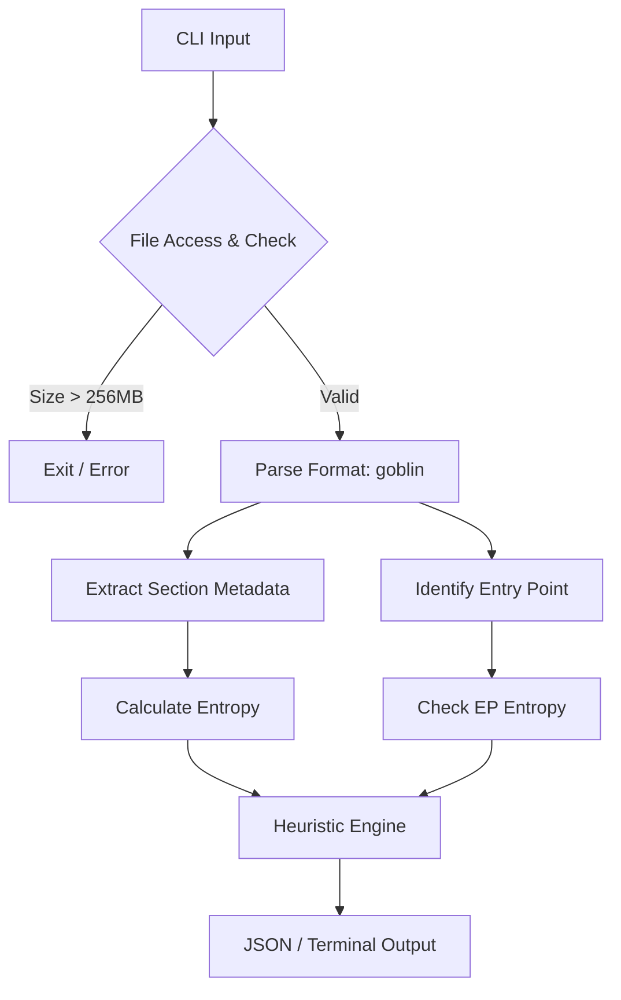

# Project Architecture | Proje Mimarisi

## System Overview | Sistem Özeti (English)
EntroRS is designed as a standalone static analysis engine written in Rust. It utilizes the `goblin` crate for multi-format parsing (PE/ELF) and performs high-speed entropy calculations on the raw bytes of each section.

### Core Modules:
- **CLI Parser (`clap`):** Handles user input, file paths, and output format selection (Standard vs. JSON).
- **File Loader:** Implements safety checks (OOM protection) and reads files into memory buffers.
- **Parsing Engine (`goblin`):** Extracts metadata, section headers, and Entry Point from the executable.
- **Mathematics Motor:** Computes Shannon Entropy for data blocks.
- **Heuristic Engine:** Applies logic-based rules to determine if a file is packed (e.g., High Entropy + Low Import Count).

## Veri Akış Şeması | Data Flow (Türkçe)
1. **Giriş:** Kullanıcı terminal üzerinden bir dosya yolu belirtir (`-f <dosya>`).
2. **Doğrulama:** Kaynak dosya kontrol edilir (maksimum 256MB limit).
3. **Parse Etme:** Dosya imzası (`MZ` veya `ELF`) kontrol edilir, ardından başlık bilgileri (Section Headers) çözülür.
4. **Entropi:** Her bir bölümün (section) byte dağılımı ölçülür.
5. **Sezgisel (Heuristic):** Elde edilen veriler (Entropi ve IAT boyutu) kurallardan geçirilir.
6. **Çıktı:** Sonuçlar okunaklı bir tablo veya otomatize sistemler için JSON formatında sunulur.

---

## Modül Yapısı | Module Structure

